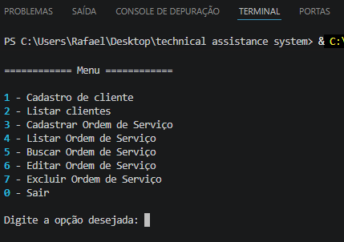
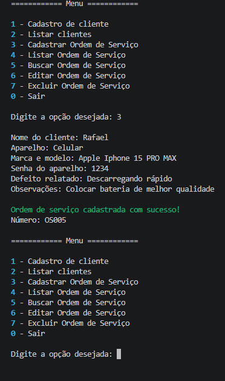
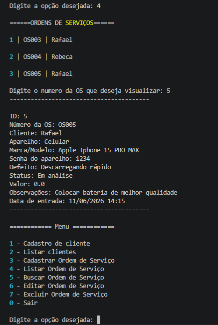
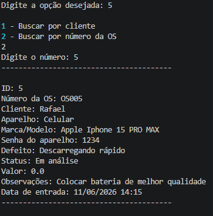
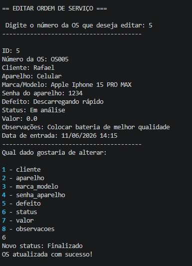
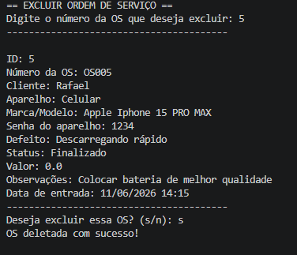

# Sistema de Assistência Técnica

Sistema de gerenciamento de assistência técnica desenvolvido em Python e SQLite para estudo de programação, banco de dados e controle de versões com Git e GitHub.

## Funcionalidades

### Clientes

* Cadastro de clientes
* Listagem de clientes cadastrados

### Ordens de Serviço

* Cadastro de ordens de serviço
* Listagem de ordens de serviço
* Busca por número da OS
* Busca por cliente
* Edição de ordens de serviço
* Exclusão de ordens de serviço

## Tecnologias Utilizadas

* Python 3
* SQLite3
* Git
* GitHub

## Estrutura do Projeto

```text
.
├── cliente.py
├── ordem_servico.py
├── database.py
├── main.py
├── README.md
└── .gitignore
```

## Como Executar

1. Clone o repositório:

```bash
git clone https://github.com/devrafael16/technical-assistance-system.git
```

2. Entre na pasta do projeto:

```bash
cd technical-assistance-system
```

3. Execute o sistema:

```bash
python main.py
```

O banco de dados será criado automaticamente na primeira execução.

## Objetivos do Projeto

Este projeto foi desenvolvido com o objetivo de praticar:

* Programação orientada a objetos
* Manipulação de banco de dados SQLite
* Operações CRUD (Create, Read, Update e Delete)
* Organização de código em módulos
* Controle de versão com Git e GitHub

## Melhorias Futuras

* Edição de clientes
* Exclusão de clientes
* Relacionamento entre clientes e ordens de serviço
* Interface gráfica
* API com Flask
* Versão Web

## Autor

Desenvolvido por Rafael Henrique como projeto de estudos e portfólio.

## Capturas de Tela

### Menu Principal



### Cadastro de Ordem de Serviço



### Listagem de Ordens de Serviço



### Busca de Ordem de Serviço



### Edição de Ordem de Serviço



### Exclusão de Ordem de Serviço


